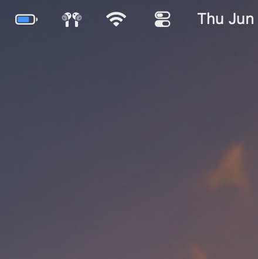
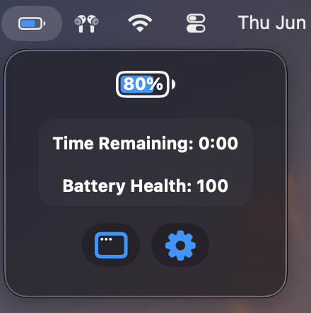
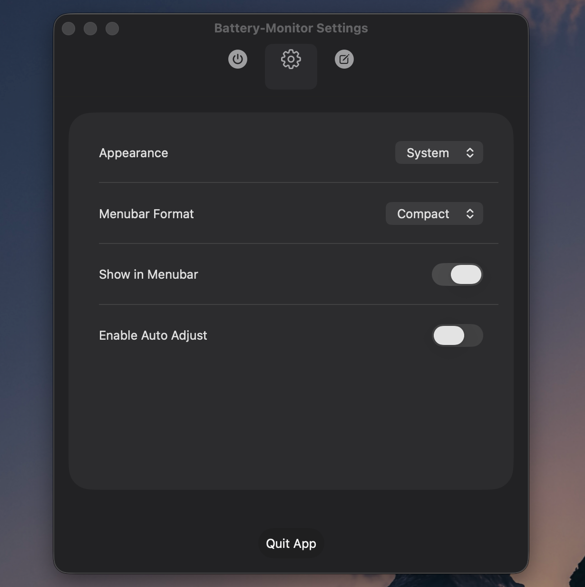
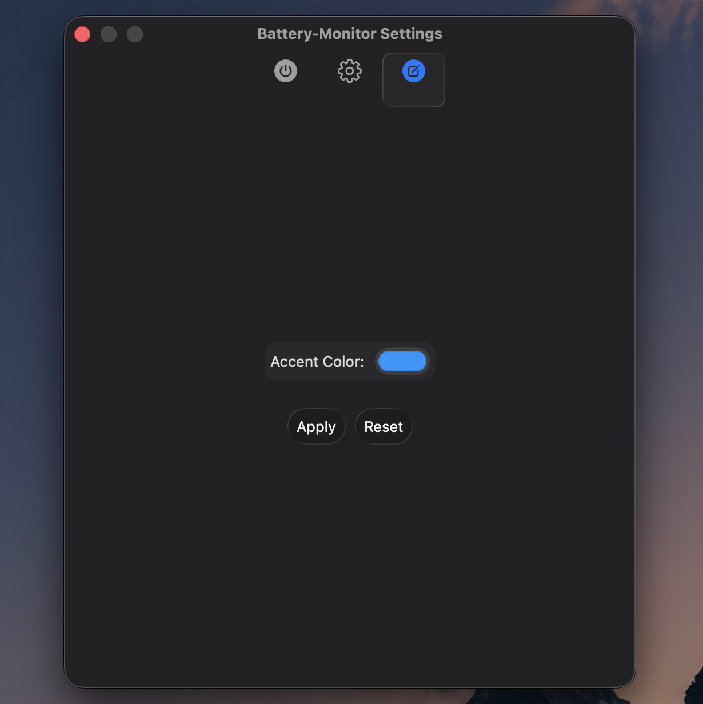
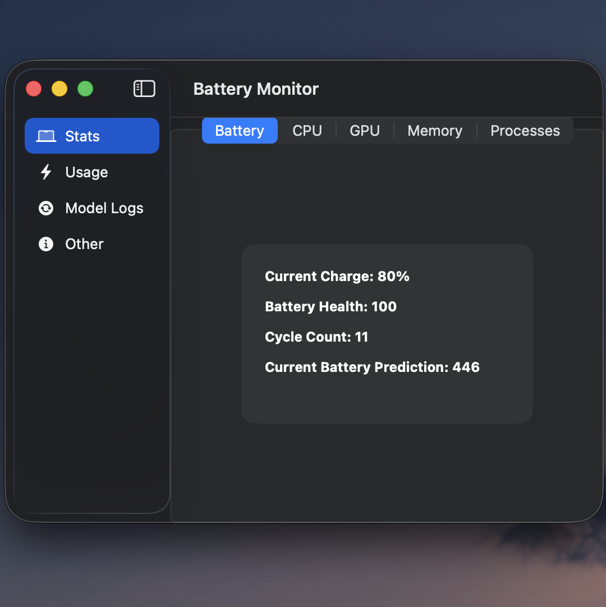
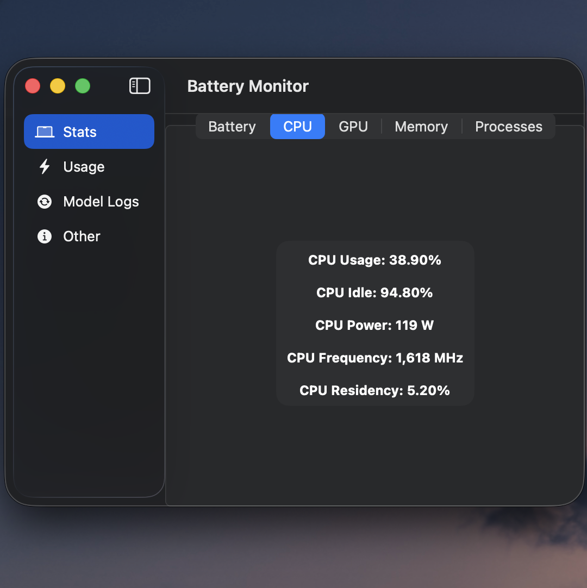

# MacOS Battery Monitor

## Features
### Menu Bar Icon
- adds a menubar icon that dyanmically displays the  
current estimated time remaining on battery and to full charge
- shows battery percent, time remaining remaining, and battery health on click
- button for accessing the main app window for a more detailed overview
- button for accessing settings window for customization

### Main App
#### Battery 
- Displays: current charge, battery health, cycle count, and the models current battery prediction

#### CPU
- Displays: CPU usage, idle, power, frequency, and residency
#### GPU
- Displays: GPU usage, idle, power, frequency, and residency
#### Memory
- Displays: Total memory and used memory
#### Processes
- Displays: 
  - the number of processes, process power, and the number of running processes

### Settings
#### Customization
- System, dark, and light modes.
- Default or compact menu bar view.
- Customizable app accept color.

## Screenshots

<table>
  <tr>
    <td>
      <strong>Menubar Icon</strong> 
      
    </td>
    <td>
      <strong>On Click</strong> 
      
    </td>
  </tr>
      <td>
      <strong>General</strong> 
      
    </td>
        <td>
      <strong>Customization</strong> 
      
    </td>
  <tr>
    </tr>
      <td>
      <strong>Battery Details</strong> 
      
    </td>
        <td>
      <strong>CPU Details</strong> 
      
    </td>
  </tr>
</table>